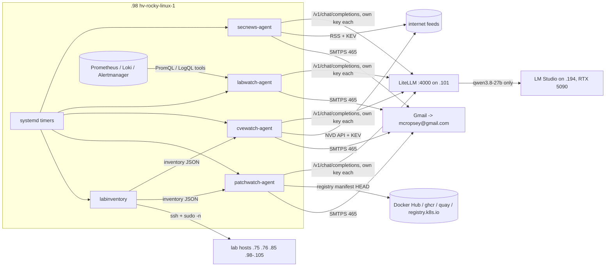

# mikes-agents

Small, scheduled AI agents for the Cropsey home lab. They all run on **192.168.1.98** (hv-rocky-linux-1)
as podman containers started by systemd timers. They reach the local LLM (**qwen3.8-27b** in LM Studio on an
RTX 5090) only through the **LiteLLM** gateway on .101, and they email their reports through Gmail.

| Agent | What it does | Schedule (America/Chicago) | Manual run on .98 |
|---|---|---|---|
| [secnews-agent](secnews-agent/) | Cybersecurity news briefing from 9 RSS feeds + CISA KEV | daily 06:00 | `secnews` |
| [labwatch-agent](labwatch-agent/) | Lab health briefing; investigates Prometheus/Loki with its own tool calls | daily 06:15 | `labwatch` |
| [cvewatch-agent](cvewatch-agent/) | Matches newly published CVEs against the software in the lab; emails only if affected | daily 06:30 | `cvewatch` |
| [patchwatch-agent](patchwatch-agent/) | Weekly patch plan: OS updates, security advisories, reboots, container image drift | Mondays 06:45 | `patchwatch` |
| [labinventory](labinventory/) | Software inventory of every lab host over SSH (no LLM); feeds cvewatch + patchwatch | daily 05:30 | `labinventory` |

Shared code for labwatch/cvewatch/patchwatch is in [lab-agents-common](lab-agents-common/) (one image,
`localhost/labagents`). secnews is standalone (image `localhost/secnews`). LiteLLM registration is in
[litellm](litellm/).

## Architecture



```
 05:30 labinventory ──ssh──► 11 lab hosts ──► /opt/labagents/data/inventory/latest.json
 06:00 secnews  ─┐
 06:15 labwatch ─┼─► LiteLLM (.101:4000) ──► LM Studio qwen3.8-27b (.194, RTX 5090)
 06:30 cvewatch ─┤        one virtual key + agent-registry entry per agent
 Mon   patchwatch┘
        └──► reports saved on .98 + emailed via smtp.gmail.com:465
```

## Design rules

- **Local model only, one model only.** Every key is restricted to `qwen3.8-27b`. Calling other LM Studio
  models makes them load next to qwen3.8 and pushes it onto the CPU (~0.3 tok/s).
- **Run before the workday.** The GPU is used interactively 08:00-22:00, so all schedules finish before 07:00.
  A typical morning uses the GPU for ~5 minutes in total (secnews ~1.5 min, labwatch ~1.5 min, cvewatch ~1.5 min).
- **One LiteLLM key and one agent-registry entry per agent**, so spend and traffic are attributed per agent
  on the LiteLLM *Agents* page. Keys allow 1 request in flight and 30 rpm.
- **Guardrail opt-out.** LiteLLM's `basic-safety-filter` content filter (on by default for all traffic) blocks
  normal security vocabulary ("attack", "exploit"...). The agent keys carry
  `metadata.opted_out_global_guardrails: ["basic-safety-filter"]`; the filter stays on for everything else.
- **No secrets in this repo.** Keys and the Gmail app password live only in root-only env files on .98
  (`/opt/secnews/secnews.env`, `/opt/labagents/labagents.env`). The `*.env.example` files are templates.

## Layout on .98

| Path | Contents |
|---|---|
| `/opt/secnews/` | `app/` (secnews.py, Containerfile), `secnews.env` (600), `data/reports/` |
| `/opt/labagents/` | `app/labagents/` (common + agent modules), `app/labinventory.py`, `app/Containerfile`, `hosts.conf`, `labagents.env` (600), `data/inventory/`, `data/reports/<agent>/` |
| `/usr/local/bin/` | `secnews`, `labwatch`, `cvewatch`, `patchwatch`, `labinventory` |
| `/etc/systemd/system/` | `<name>.service` + `<name>.timer` for each |

Reports: `/opt/secnews/data/reports/latest.html` and `/opt/labagents/data/reports/<agent>/latest.html`.

## Install everything from scratch

Prerequisites on .98: Rocky 9, rootful podman, `sudo`, passwordless SSH from `mcropsey` to every lab host
with `sudo -n` there (only labinventory needs that). On .101: LiteLLM in the `litellm` podman container.
A Gmail app password (https://myaccount.google.com/apppasswords, needs 2-Step Verification).

1. **LiteLLM keys** (on .101): see [litellm/README.md](litellm/README.md). One key per agent.
2. **secnews**: see [secnews-agent/README.md](secnews-agent/README.md).
3. **Shared lab-agents image + env**: see [lab-agents-common/README.md](lab-agents-common/README.md).
4. **labinventory**, then **labwatch**, **cvewatch**, **patchwatch**: see each folder's README.

Quick version, run from a checkout of this repo on .98:

```bash
# shared image
sudo mkdir -p /opt/labagents/app/labagents /opt/labagents/data && sudo chown mcropsey: /opt/labagents/data
sudo cp lab-agents-common/labagents/*.py labwatch-agent/labwatch.py cvewatch-agent/cvewatch.py \
        patchwatch-agent/patchwatch.py /opt/labagents/app/labagents/
sudo cp lab-agents-common/Containerfile /opt/labagents/app/
sudo install -m 600 lab-agents-common/labagents.env.example /opt/labagents/labagents.env   # fill in keys + SMTP_PASS
sudo podman build -t localhost/labagents:latest -f /opt/labagents/app/Containerfile /opt/labagents/app

# inventory collector (runs on the host as mcropsey)
sudo install -m 755 labinventory/labinventory.py /opt/labagents/app/labinventory.py
sudo install -m 644 labinventory/hosts.conf /opt/labagents/hosts.conf

# wrappers + timers
for a in labinventory/labinventory labwatch-agent/labwatch cvewatch-agent/cvewatch patchwatch-agent/patchwatch; do
  sudo install -m 755 $a /usr/local/bin/; done
sudo cp labinventory/*.service labinventory/*.timer labwatch-agent/*.service labwatch-agent/*.timer \
        cvewatch-agent/*.service cvewatch-agent/*.timer patchwatch-agent/*.service patchwatch-agent/*.timer \
        /etc/systemd/system/
sudo systemctl daemon-reload
sudo systemctl enable --now labinventory.timer labwatch.timer cvewatch.timer patchwatch.timer

labinventory && labwatch --no-email && cvewatch --no-email && patchwatch --no-email   # smoke test
```

## Operating

```bash
systemctl list-timers 'secnews*' 'lab*' 'cvewatch*' 'patchwatch*'   # next runs
journalctl -u labwatch --since today                                 # logs of a scheduled run
labwatch --help                                                      # every agent takes --no-email / --to
```

To change code: edit the file under `/opt/labagents/app/labagents/` (or `/opt/secnews/app/`), then rebuild
that image with the `podman build` line above. Env-file edits apply on the next run without a rebuild.

## Troubleshooting (all agents)

| Symptom | Cause / fix |
|---|---|
| `Content blocked: harmful_violence ... 'attack'` (HTTP 400) | Key isn't opted out of `basic-safety-filter`; add `opted_out_global_guardrails` to the key metadata (see litellm/). |
| `model gave no JSON answer` / `finish_reason=length` | qwen3.8's reasoning used up `max_tokens` (24000). Shrink the prompt or raise the limit in `common.py`. |
| Very slow LLM calls | Another model is loaded in LM Studio next to qwen3.8; unload it. |
| Email `535` auth error | Gmail app password revoked or Google password changed; make a new app password, update both env files. |
| `401`/`403` from LiteLLM | Key deleted or its model list changed; re-run `litellm/register_agent.py` for that agent. |
| No email at all | `journalctl -u <agent> --since today`. A failed run sends nothing; cvewatch also stays quiet when nothing affects the lab. |
